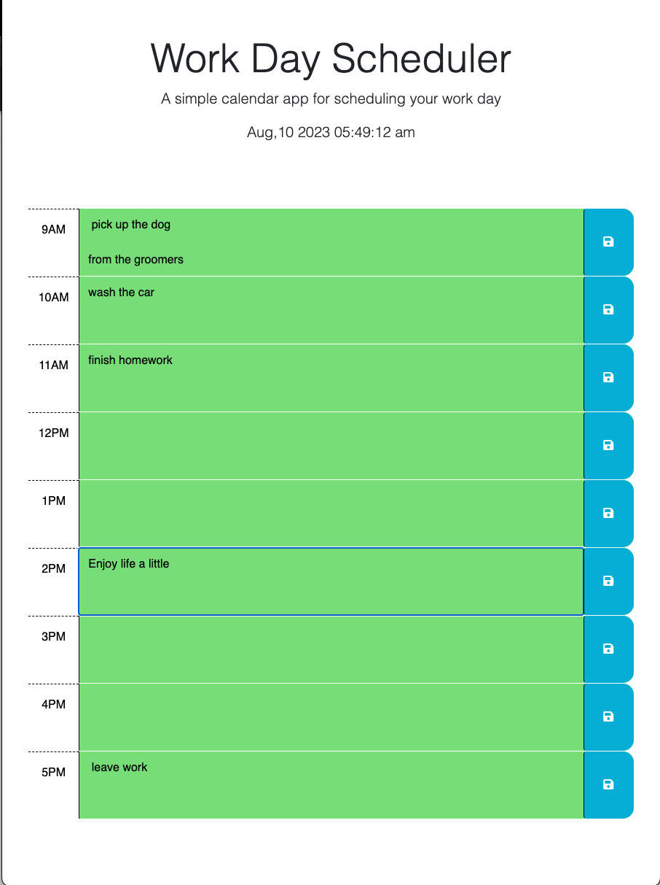

# to_do_or_not_to_do
Daily Todo list using day.js

# Work Day Scheduler

A simple calendar app for scheduling your work day.

## Table of Contents

- [Description](#description)
- [Preview](#preview)
- [Technologies Used](#technologies-used)
- [Usage](#usage)
- [Getting Started](#getting-started)
- [License](#license)

## Description

Work Day Scheduler is a web application designed to help you manage your work day by providing a visual schedule for different hours. It allows you to enter and save tasks for each hour of the day. The schedule layout uses different colors to indicate past, present, and future time blocks.

## Preview

## Technologies Used

- HTML
- CSS (Bootstrap framework)
- JavaScript (jQuery library)
- [Day.js](https://github.com/iamkun/dayjs) library for date and time manipulation

## Usage

1. The application displays time blocks for different hours of the work day.
2. Each time block includes a text area to input tasks and a save button.
3. The background color of the time blocks changes based on whether the time is in the past, present, or future.
4. To save a task, enter the task description in the textarea for the corresponding time block and click the save button.
5. Saved tasks will be stored locally and displayed when you revisit the page.

## Getting Started

## License

This project is licensed under the MIT License - see the [LICENSE](LICENSE) file for details.

---

